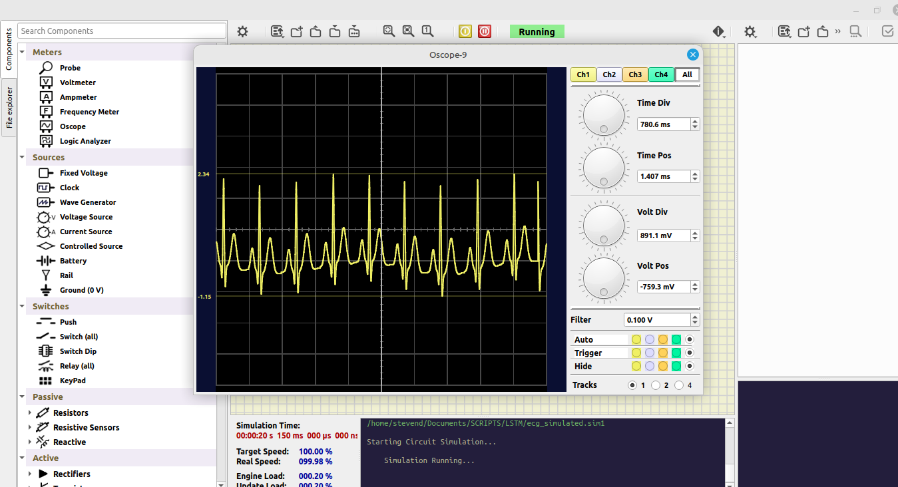

# ECG LSTM + Generador WAV 8‑bit
En el proyecto se desarrolló un modelo de clasificación de señales ECG sintéticas usando LSTM. Luego estas señales ECG sintética lo convertimos a WAV para ser visualizado en el software SIMULIDE para posteriormente interactuar con algún sistema embebido.

## Descripción
- Proyecto con dos partes principales:
  - Clasificación de señales ECG sintéticas con un modelo LSTM (Keras/TensorFlow).
  - Generación de un WAV mono de 8‑bit (uint8) y exportación a arreglo C (`ecg_data.h`) a partir de un ECG simulado (NeuroKit2), útil para Arduino/SimulIDE.
  

## Contenido del repo
- `code_basic.ipynb`: Notebook que genera un dataset sintético de ECG con NeuroKit2 (clases: normal, bradicardia, taquicardia), entrena un LSTM bidireccional y reporta métricas (accuracy, F1, matriz de confusión).
- `gen_ecg_wav.ipynb`: Notebook con utilidades para convertir una señal ECG a WAV mono 8‑bit sin signo y exportar el mismo contenido a un header C.
- `ecg_10s_8bit_500Hz.wav`: WAV de ejemplo (10 s, 500 Hz, 8‑bit) generado por el notebook.
- `ecg_data.h`: Header C auto‑generado con muestras uint8 y metadatos (`*_FS`, `*_N`).

### Requisitos
- Python 3.10+ (probado con 3.12)
- Paquetes principales: `jupyter`, `numpy`, `pandas`, `matplotlib`, `scikit-learn`, `tensorflow-cpu`, `neurokit2`

### Instalación rápida (entorno virtual)
- Crear entorno e instalar dependencias mínimas para ambos notebooks:
  - `python -m venv .venv && source .venv/bin/activate`
  - `python -m pip install -U pip`
  - `pip install jupyter numpy pandas matplotlib scikit-learn tensorflow-cpu neurokit2`
  - Opcional (para elegir kernel en Jupyter): `pip install ipykernel && python -m ipykernel install --user --name ecg-env` 

Uso 1: Clasificación LSTM (code_basic.ipynb)
- Abrir `code_basic.ipynb` en Jupyter y ejecutar todas las celdas.
- Flujo del notebook:
  - Genera ECG sintéticos con `neurokit2.ecg_simulate` para 3 clases: normal, bradicardia, taquicardia.
  - Preprocesa (z‑score por muestra), fija longitud (`T = duración * fs`) y divide en train/val/test.
  - Modelo: Bidirectional LSTM (64 -> 32) + Dropout + Dense, pérdida `sparse_categorical_crossentropy`, optimizador Adam.
  - Entrena con early stopping y reporta métricas en el set de test (accuracy, precision/recall/F1 y matriz de confusión).
- Parámetros principales (modificables en el notebook):
  - `N_PER_CLASS` (por defecto 100), `DURATION_S` (8 s), `FS` (200 Hz), semillas de reproducibilidad.
- Resultado esperado (datos sintéticos): alta precisión tras ~20 épocas.

Uso 2: Generar WAV 8‑bit + header C (gen_ecg_wav.ipynb)
- Abrir `gen_ecg_wav.ipynb` y ejecutar la celda principal. Incluye funciones:
  - `to_uint8_pcm(x, peak=0.95)`: normaliza [-1,1] y mapea a rango uint8 [0..255].
  - `write_wav_uint8_mono(filename, data_uint8, fs)`: escribe WAV mono 8‑bit sin signo.
  - `neurokit_ecg_to_wav8(filename, fs, duration_s, method, heart_rate, peak)`: simula ECG con NeuroKit2 y guarda el WAV.
  - `array_ecg_to_wav8(ecg_array, filename, fs, peak)`: convierte cualquier arreglo a WAV 8‑bit.
  - `export_uint8_as_c_header(data_uint8, fs, header_path, var_name)`: exporta a header C con metadatos y arreglo.
- Ejemplo (incluido en el notebook):
  - WAV: `ecg_10s_8bit_500Hz.wav` (fs=500 Hz, 10 s)
  - Header: `ecg_data.h` con:
    - `const unsigned int ecg_data_FS = 500;`
    - `const unsigned int ecg_data_N  = 5000;`
    - `const uint8_t ecg_data[5000] = { ... };`
- Uso en Arduino/SimulIDE:
  - Incluir `#include "ecg_data.h"` y usar `ecg_data[i]` a `fs = ecg_data_FS` para reconstrucción/salida DAC/PWM temporizada.

Notas y resolución de problemas
- NeuroKit2: algunas versiones requieren pasar `length=int(duration_s*fs)` en lugar de `duration`; el notebook ya fuerza `length` entero para robustez.
- Escalado a 8‑bit: `peak` < 1.0 deja margen y previene clipping; ajuste recomendado entre 0.9–0.99.
- TensorFlow CPU: si no usas GPU, `tensorflow-cpu` es suficiente. Mensajes de oneDNN pueden aparecer; no son errores.
- Reproducibilidad: se fijan semillas para `random`, `numpy` y `tensorflow` en `code_basic.ipynb`.

## Créditos
- Señal y utilidades de simulación: [NeuroKit2](https://neurokit2.readthedocs.io/)
- Modelo y entrenamiento: Keras/TensorFlow

### Útil
$ pip install pip-chill
$ pip-chill > requirements.txt

Autor: Moises Meza.
